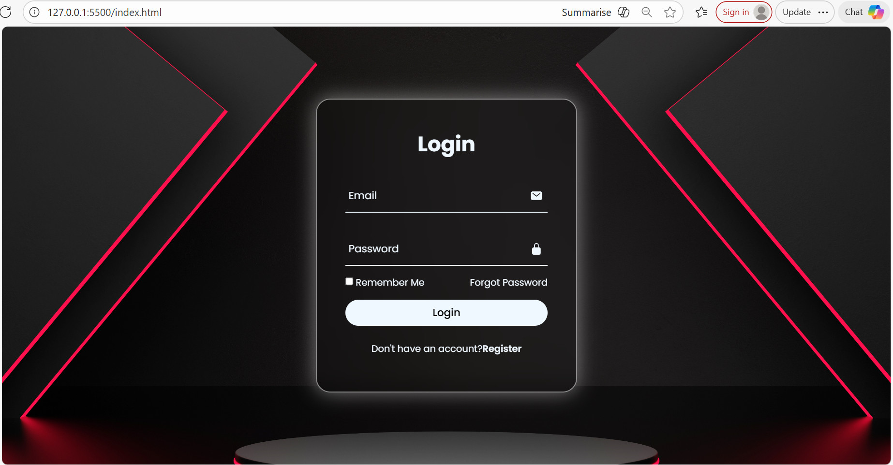

# Modern Login Page UI

# Description

A modern and responsive login page designed using HTML and CSS.
The project features a clean user interface with smooth animations, input icons, and a glassmorphism style design.
# Technologies Used
	•	HTML5
	•	CSS3
	•	Google Fonts (Poppins)
	•	Ionicons
# Features
	•	Modern login form interface
	•	Glassmorphism design effect
	•	Animated floating labels for input fields
	•	Centered responsive layout
	•	Hover effects for buttons
	•	Icons inside input fields
# What I Learned
	•	Structuring web forms using HTML
	•	Designing user interfaces using CSS
	•	Using Flexbox for layout
	•	Creating animations using CSS keyframes
	•	Adding icons using Ionicons
# How to Run the Project
	1.	Download or clone the repository.
	2.	Open the project folder.
	3.	Open the file index.html in your browser.
# Sreenshot

	
